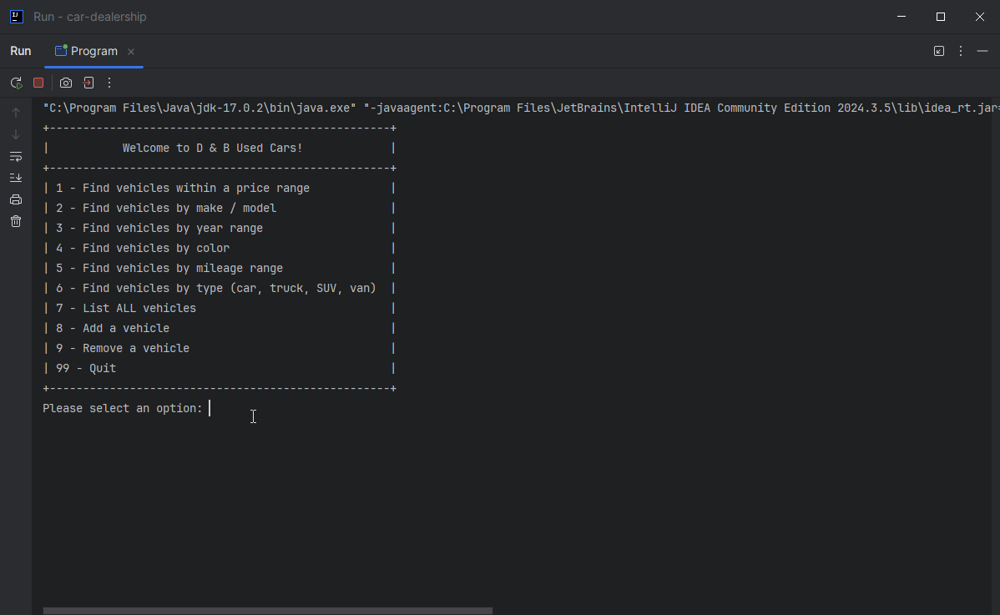

# Car Dealership

## Description of the Project
This is a virtual car dealership, fully outfitted with an inventory of vehicles to search and choose from. The program
reads from a file, populates the dealership, allows for modification, and then saves any changes to the dealership when
the user exits the program. Currently, searching allows users to input year, price, mileage, make/model, color, or vehicle 
type to search for their dream car.

## User Stories
- As an owner, I'd like to add a dealership as an object containing an inventory of vehicles so that I may contain my inventory in one organized spot and potentially add more dealerships.
- As an owner, I'd like read input from a file so that I may upload raw information to be swiftly organized and easily modifiable.
- As a customer, I'd like an intuitive menu so that I may select from a range of options and reduce the hassle of searching for and buying a car.
- As a customer, I'd like the ability to search for specific vehicles so that I may find the exact car that I'd like from a selection.

## Setup

### Prerequisites

- IntelliJ IDEA: Ensure you have IntelliJ IDEA installed, which you can download from [here](https://www.jetbrains.com/idea/download/).
- Java SDK: Make sure Java SDK is installed and configured in IntelliJ.

### Running the Application in IntelliJ

Follow these steps to get your application running within IntelliJ IDEA:

1. Open IntelliJ IDEA.
2. Select "Open" and navigate to the directory where you cloned or downloaded the project.
3. After the project opens, wait for IntelliJ to index the files and set up the project.
4. Find the main class with the `public static void main(String[] args)` method.
5. Right-click on the file and select 'Run 'YourMainClassName.main()'' to start the application.

## Technologies Used

- Java: Maven 17.
- Java I/O, scanners/file reading.

## Demo

## Future Work

- Improvement of error handling, improvement of performance.
- More dealerships!

## Resources

- [Raymond Maroun's GitHub](https://github.com/RayMaroun/yearup-spring-section-10-2025/tree/master/pluralsight) - Vital Information
- [Previous Java Project](https://github.com/AdampJessie/FinancialTracker) - Very Similar Project, recently completed
- [ChatGPT](https://chatgpt.com/) - Syntax/Formatting Assistance
- [Potato Sensei](https://chatgpt.com/g/g-681d378b0c90819197b16e49abe384ec-potato-sensei) - Necessary review, wonderful potato puns

## Team Members

- **Adam Jessie** - Front-back!

## Thanks

- Thank you to instructor Raymond Maroun for unending support and guidance.
- A special thanks to all individuals who view/use this project!
 